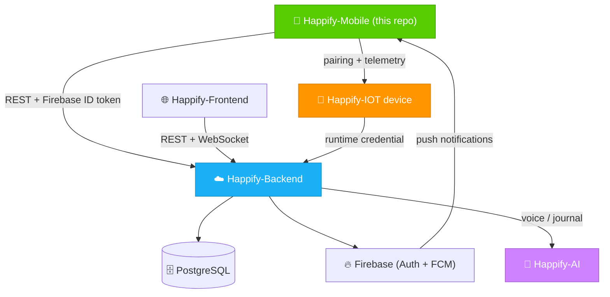
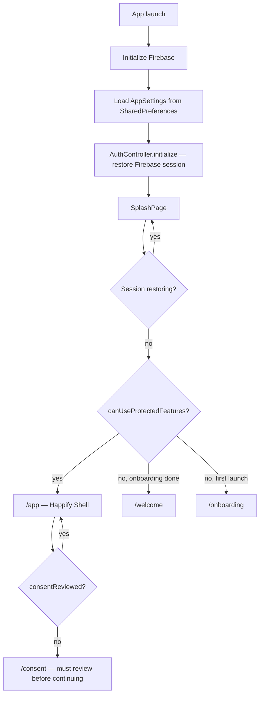
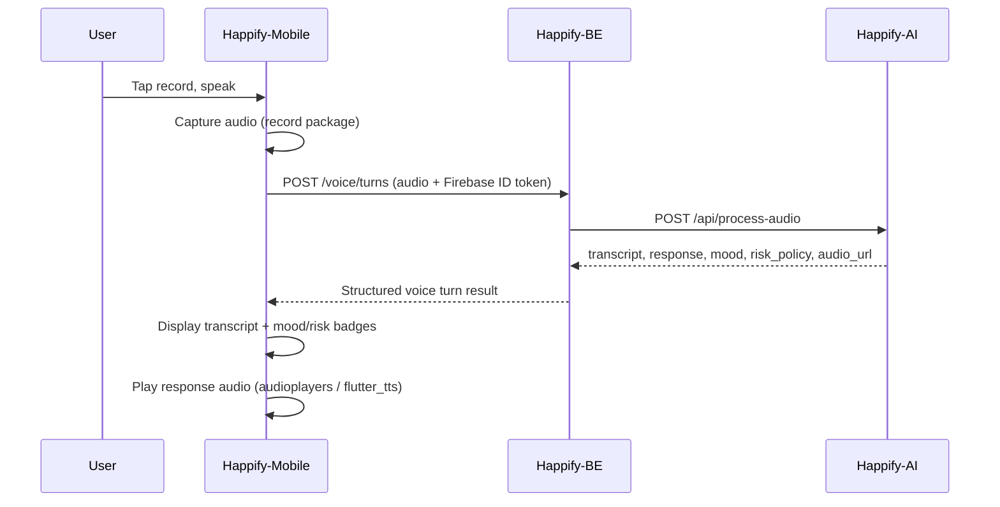
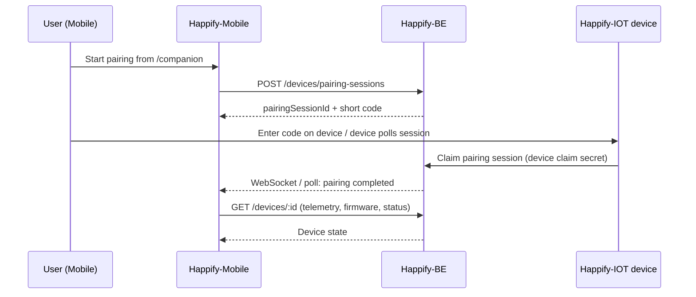
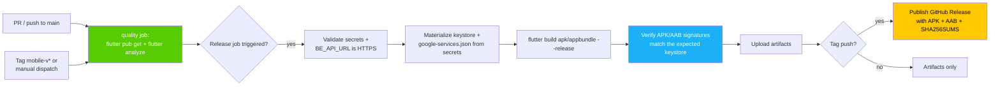

<div align="center">

# 📱 Happify-Mobile — Flutter Companion App

### *Detect Early. Support Meaningfully. Grow for Life.*

[](https://flutter.dev/)
[](https://dart.dev/)
[](https://bloclibrary.dev/)
[](https://pub.dev/packages/go_router)
[](https://firebase.google.com/)
[](.github/workflows/android.yml)
[](../LICENSE)
[](https://garudahacks.com/)

<br/>

**The Flutter companion app of Happify — mood tracking, journaling, mindfulness, an AI voice companion, anonymous community support, professional care, and companion-device management, all in one pocket-sized, accessible client.**

[🌐 Frontend](https://github.com/Happiffy/Happify-FE) · [☁️ Backend](https://github.com/Happiffy/Happify-BE) · [🧠 AI](https://github.com/Happiffy/Happify-AI) · [📱 Mobile](https://github.com/Happiffy/Happify-Mobile) · [🔌 IoT](https://github.com/Happiffy/Happify-IOT)

</div>

---

## 📌 Overview

Happify-Mobile is the **on-the-go client** of the Happify ecosystem. Everything the web dashboard offers is available here too — plus voice conversations with the AI companion, mindfulness exercises, and direct management of a paired Happify Companion (IoT) device — packaged as a single Flutter codebase targeting Android and iOS.

> **Happify-Mobile's role in the ecosystem:**
> *"A friend who is here to listen — wherever the user is, not just at a desk."*

Like the web frontend, the mobile app **never calls Happify-AI directly**. Every request — mood entries, journals, voice turns, community posts, referrals — goes through **Happify Backend**, which brokers AI access, enforces auth, and persists everything.

| | |
|---|---|
| **Framework** | Flutter 3.38 (stable) |
| **Language** | Dart ~3.10 |
| **State Management** | `flutter_bloc` (Cubit-based) |
| **Navigation** | `go_router` with auth-aware redirects |
| **Auth** | Firebase Auth (Email/Password + Google) |
| **Networking** | Dio (`ApiClient`, shared across repositories) |
| **Notifications** | Firebase Cloud Messaging |
| **Audio** | `record`, `audioplayers`, `flutter_tts` |
| **Distribution** | Signed Android APK/AAB via GitHub Actions |

---

## 🌐 Happify Ecosystem

Happify-Mobile talks to the same backend as the web app — mood, journal, community, care, and device-pairing data are shared across both clients in real time.

| Repository | Role | Link |
|---|---|---|
| 🌐 **Happify-FE** | Web dashboard — mood, journal, community, care | [Happiffy/Happify-FE](https://github.com/Happiffy/Happify-FE) |
| ☁️ **Happify-BE** | Node.js API, PostgreSQL, Firebase, WebSocket hub | [Happiffy/Happify-BE](https://github.com/Happiffy/Happify-BE) |
| 🧠 **Happify-AI** | FastAPI service — journal reflection, risk detection, voice processing | [Happiffy/Happify-AI](https://github.com/Happiffy/Happify-AI) |
| 📱 **Happify-Mobile** | Flutter app for mood tracking, journaling, and care access on the go *(this repo)* | [Happiffy/Happify-Mobile](https://github.com/Happiffy/Happify-Mobile) |
| 🔌 **Happify-IOT** | Voice-companion device paired and managed from this app | [Happiffy/Happify-IOT](https://github.com/Happiffy/Happify-IOT) |

**System architecture:**



**Principles this app is built around:**

- **Privacy by design** — Community participation is alias-based, and location/heatmap data stays coarse and anonymous.
- **Safety first** — Voice and journal risk signals are computed by Happify-AI via the backend; the app surfaces them, it never decides on its own.
- **Human support matters** — Care chat, referrals, and emergency contacts are one tap away from the home shell.
- **Accessible by default** — Built-in text scaling, high contrast, reduced motion, and screen-reader-oriented settings, applied globally via `MediaQuery` overrides in `main.dart`.
- **Secure operations** — Firebase config files (`google-services.json`, `GoogleService-Info.plist`) and the Android upload keystore are Git-ignored and injected only at CI release time.

---

## ✨ Features

- 🔐 **Authentication** — Firebase email/password and Google sign-in, session restoration on launch, and guest mode when Firebase isn't configured.
- 🧭 **Onboarding & Consent** — Illustrated intro slides, a guided account setup flow, and an explicit consent review screen before protected features unlock.
- 😊 **Mood Tracker & Analytics** — Daily mood check-ins with trend charts and voice-conversation mood patterns.
- 📓 **Daily Journaling** — Private reflections synced to the backend, enriched with AI-generated mood, risk level, and reflection text.
- 🎙️ **AI Voice Companion** — Record a voice turn, see the live transcript, detected mood/risk, and play back the generated spoken reply.
- 🧘 **Mindfulness** — Breathing, grounding, and meditation exercises with per-activity progress tracking.
- 🫂 **Anonymous Community** — Alias-based posts, comments, and support reactions in a moderated peer space.
- 🤝 **Professional Care** — Request referrals, browse providers, and chat live with an accepted psychologist (`/care`, `/care/chat/:sessionId`).
- 🔌 **Companion Device Management** — Pair a Happify Companion device, inspect telemetry, manage firmware/OTA status, and send haptic/display commands.
- 📝 **Consent Center** — Granular consent toggles for AI processing, voice processing, device emotion observation, and heatmap contribution.
- ♿ **Accessibility Controls** — Text scale, high contrast, reduced motion, and screen-reader optimization, applied app-wide.
- 🔔 **Push Notifications** — FCM token registration and per-category notification preferences (care chat, referrals, mood reminders, wellbeing updates).
- 🆘 **Emergency Contacts** — Add, edit, and mark a primary emergency contact directly from the profile.

---

## 🛠️ Tech Stack

| Layer | Technology | Purpose |
|---|---|---|
| **Framework** | Flutter 3.38 (stable) | Cross-platform UI for Android and iOS |
| **Language** | Dart ~3.10 | Null-safe, strongly typed application code |
| **State Management** | `flutter_bloc` + `equatable` | Cubit-per-feature pattern (`mood`, `journal`, `care`, `community`, `companion`, `consent`, `home`, `profile`) |
| **Navigation** | `go_router` | Declarative routing with an auth-aware `redirect` guard |
| **Networking** | `dio` | Shared `ApiClient` wrapping every backend call |
| **Authentication** | `firebase_auth`, `google_sign_in`, `sign_in_button` | Email/password and Google sign-in |
| **Push Notifications** | `firebase_messaging` | Foreground/background FCM handling |
| **Voice** | `record`, `audioplayers`, `flutter_tts` | Recording, playback, and text-to-speech for the AI companion |
| **Maps** | `flutter_map` + `latlong2` | Anonymous heatmap / location-aware views |
| **Rich Content** | `flutter_html` | Rendering journal/community HTML content |
| **Media** | `image_picker` | Attaching images to journals, posts, and chat |
| **UI** | `google_fonts`, `phosphor_flutter`, `iconify_flutter`, `colorful_iconify_flutter` | Typography and iconography matching the Happify design system |
| **Local Storage** | `shared_preferences`, `path_provider` | Settings persistence and file paths |
| **Location** | `geolocator` | Location access for heatmap contribution |
| **Testing** | `flutter_test` | Widget/design-system regression tests |
| **Distribution** | `flutter_launcher_icons`, GitHub Actions | App icon generation and signed Android release builds |

---

## 📁 Project Structure

```text
Happify-Mobile/
├── lib/
│   ├── main.dart                  # Entry point, GoRouter routes + auth redirect guard
│   │
│   ├── core/
│   │   ├── app_services.dart      # ApiClient (Dio), AuthController, AppSettings,
│   │   │                          # SpeechService, PushService — the app's service layer
│   │   ├── happify_repository.dart # Shared REST calls (profile, preferences, media, etc.)
│   │   ├── di/app_scope.dart       # InheritedWidget wiring for services
│   │   ├── theme/                  # happify_colors.dart, happify_theme.dart
│   │   └── widgets/                 # Shared buttons, emoji icons, quokka badge, etc.
│   │
│   └── features/                    # One folder per domain, each with bloc/ + data/
│       ├── home/                     # Dashboard shell and entry
│       ├── mood/                      # Mood tracking and analytics
│       ├── journal/                    # Daily journaling
│       ├── companion/                   # Device pairing, telemetry, firmware/OTA
│       ├── community/                    # Anonymous peer community
│       ├── care/                          # Referrals and live care chat
│       ├── consent/                        # Consent management
│       ├── profile/                         # Profile, password, notifications, psychologist application
│       ├── onboarding/                       # Account setup flow
│       ├── media/                             # Image upload repository
│       └── *_pages.dart                       # Route-level page composition per module
│
├── assets/
│   ├── mascot/                    # App icon + quokka artwork
│   └── illustrations/             # Onboarding and auth illustrations
│
├── android/                       # Android project (signing config injected at CI time)
├── ios/                           # iOS project (Runner target)
├── .github/workflows/android.yml  # CI: analyze on every PR, signed release on tag/dispatch
├── test/                          # Widget and design-system regression tests
├── .env.example
└── pubspec.yaml
```

Each feature module follows the same shape: a **Cubit** (`bloc/*_cubit.dart`) holding an immutable **State** (`bloc/*_state.dart`), backed by a **Repository** (`data/*_repository.dart`) that calls `HappifyRepository`/`ApiClient`, with a top-level `bloc_<feature>_page.dart` composing the UI.

---

## ⚙️ How the App Works

**Startup and auth-aware routing** (`main.dart`):



**A voice companion turn:**



**Companion-device pairing:**



---

## 🗺️ Application Routes

| Path | Description |
|---|---|
| `/` | Splash screen — Firebase session restoration |
| `/onboarding` | First-launch illustrated intro |
| `/welcome` | Sign-in entry point |
| `/login` · `/register` · `/forgot` | Email/password and Google authentication |
| `/setup` | Post-registration account onboarding |
| `/consent` | Mandatory consent review before protected features |
| `/app` | Main Happify shell (home, mood, journal, mindfulness, profile tabs) |
| `/companion` | Companion-device pairing and management |
| `/voice` | AI Voice Companion |
| `/care` · `/care/chats` · `/care/request` · `/care/chat/:sessionId` | Referrals, care-chat list, new request, live chat |
| `/contacts` · `/contacts/new` · `/contacts/edit` | Emergency contact management |
| `/profile/edit` · `/profile/password` · `/profile/psychologist` | Profile editing, password change, psychologist verification |
| `/notifications` | Notification preference settings |

`GoRouter`'s `redirect` callback (in `main.dart`) centrally enforces: unauthenticated users are bounced to `/welcome`, authenticated-but-not-yet-consented users are forced through `/consent`, and already-authenticated users are redirected away from `/login`/`/register`/`/welcome` straight into `/app`.

---

## 🔐 Environment Variables

Flutter reads configuration through `--dart-define` / `--dart-define-from-file`, **not** a bundled `.env` file. Create a local `.env` from `.env.example` for reference:

```env
BE_API_URL=https://happify-be-production.up.railway.app
```

| Variable | Description |
|---|---|
| `BE_API_URL` | Base URL of Happify Backend — the only backend the app talks to |

> The mobile app deliberately does **not** define an `AI_SERVICE_BASE_URL` — AI access is always brokered by Happify Backend.

**Firebase configuration** is provided through the official native files, not environment variables:

- Android → `android/app/google-services.json`
- iOS → `GoogleService-Info.plist`, added to the Runner target in Xcode

Both are Git-ignored. Without them, the app still opens in **guest mode**, but authentication and push notifications are unavailable.

---

## 🚀 Getting Started

### Prerequisites

- Flutter `3.38.9` (stable channel)
- Dart `3.10.8`
- Android Studio or Xcode for your target platform
- A reachable Happify Backend instance
- Firebase project configuration for the target platform(s)

### Installation

```bash
git clone https://github.com/Happiffy/Happify-Mobile.git
cd Happify-Mobile
flutter pub get
```

### Run on the Android Emulator

Create `.env.emulator`:

```env
BE_API_URL=http://10.0.2.2:4000
```

```bash
flutter run --dart-define-from-file=.env.emulator
```

`10.0.2.2` is the Android emulator's alias for the host machine's `localhost`.

### Run on a Physical Device

```bash
flutter run --dart-define=BE_API_URL=https://your-backend.example
```

### Local Release Build

```bash
flutter build apk --release --dart-define-from-file=.env
flutter build appbundle --release --dart-define-from-file=.env
```

### Verification

```bash
flutter analyze
flutter test
flutter build apk --debug --dart-define-from-file=.env
```

---

## 🤖 CI/CD — Android Release Pipeline

`.github/workflows/android.yml` runs on every pull request and push to `main`, plus a dedicated signed-release job:



The release job requires five repository secrets — `ANDROID_KEYSTORE_BASE64`, `ANDROID_KEYSTORE_PASSWORD`, `ANDROID_KEY_ALIAS`, `ANDROID_KEY_PASSWORD`, `GOOGLE_SERVICES_JSON_BASE64` — and an optional `BE_API_URL` repository variable/secret (defaults to the production API). It also asserts the decoded `google-services.json` belongs to the correct Firebase project (`happify-990c2`) and Android package (`com.happify.app.mobile_happify`) before building.

---

## 🎓 Project Context

<div align="center">

Built for

### **Garuda Hacks 7.0 — International Hackathon Competition**

*AI-Powered Mental Wellness Platform*

</div>

Happify-Mobile is the **on-the-go client** of **Happify**, a privacy-aware digital wellbeing ecosystem built around early detection, meaningful support, and lifelong emotional growth:

| Layer | Component | Role |
|---|---|---|
| 🌐 **Web** | [Happify-FE](https://github.com/Happiffy/Happify-FE) | Mood tracking, journaling, anonymous community, care workflows |
| ☁️ **Backend** | [Happify-BE](https://github.com/Happiffy/Happify-BE) | API, PostgreSQL, Firebase, WebSocket hub, safety & moderation |
| 🧠 **AI** | [Happify-AI](https://github.com/Happiffy/Happify-AI) | Journal reflection, risk detection, voice processing |
| 📱 **Mobile** | **Happify-Mobile** *(this repo)* | Flutter app for on-the-go mood tracking and care access |
| 🔌 **IoT** | [Happify-IOT](https://github.com/Happiffy/Happify-IOT) | Voice-companion device paired from this app |

---

## 👥 Team

<div align="center">

**Outstanding BINUSIAN Team — Garuda Hacks 7.0**

| Name | Role |
|---|---|
| **Andrian Pratama** | Full-stack Developer |
| **Khalisa Amanda Sifa Ghaizani** | IoT Engineer |
| **Michella Arlene Wijaya Radika** | Product Developer |
| **Stanley Nathanael Wijaya** | Product Developer |

</div>

---

## 📄 License

This project is licensed under the **MIT License** — free to use, modify, and distribute.

```
MIT License

Copyright (c) 2026 Happify — Garuda Hacks 7.0

Permission is hereby granted, free of charge, to any person obtaining a copy
of this software and associated documentation files (the "Software"), to deal
in the Software without restriction, including without limitation the rights
to use, copy, modify, merge, publish, distribute, sublicense, and/or sell
copies of the Software.
```

<br/>

*"Detect early. Support meaningfully. Grow for life."*

<br/>

[](https://garudahacks.com/)

<br/>
Made with 🌱 for Garuda Hacks 7.0

</div>